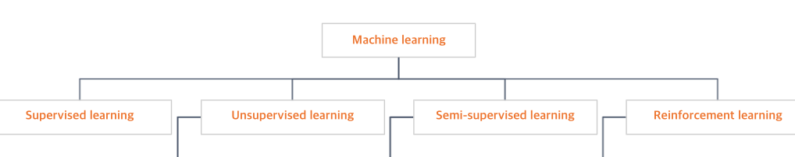

# 머신러닝에 대해 알아보자!

## 데이터의 정답여부에 따라 나뉘는 분류

정답이있다 → 지도 학습, 준지도 학습 (자신이 스스로 정답을 만든다 ~ Like LLM)

정답이 없다 → 비지도 학습

보상에 따른 학습 → 강화 학습(함수 극대화?)

참고) 해당 순서도를 통해서 적합한 모델을 선정 가능하다

## 1. 지도 학습

2가지 분류

1. Classification → Class로 구분될수 있는 Catergorical한(카테고리가 존재하는 데이터를 분류 ex) 개, 고양이 ~ Like LLM)
    
    참고) 빨간 네모 박스는 생존 여부에 대해 0,1로 예측 진행한 것이다.
    
    
    
2. Regression → 연속적인 형태의 정답을 맞추기 위해 사용(나이와 같은 연속적인 데이터)
    
    참고) 빨간 네모 박스는 나이에 대한 예측을 진행한 것이다.
    
    
    

## 2. 비지도 학습

Clustering 알고리즘 → 데이터에 대한 정답X, 유사한 특성 데이터끼리 군집화 하는 것(특정 지점에 모이는 것)

Association→ 학습 데이터에 정답X, 열을 묶어서(Grouping) 동시에 일어날 연관성을 찾는 것

Transform → 데이터를 쉽게 해석 가능하게 처리하는 것, 고차원의 데이터를 저차원으로 차원수를 줄임(차원축소 알고리즘(PCA, t-SNE) → 차원의 저주(Curse of Dimensionality) 방지 → 희소 행렬(Sparse Matrix)로 인해 결측치로 예측력이 저하되는 것 방지)

1. Clustering(군집화)의 목표 
    1. 군집 간 유사성 최소화 (서로 다른 군집 간 데이터는 확실히 다름)
    2. 군집 내 유사성 최대화 (같은 군집 간 데이터는 확실히 비슷)
2. Clustering 평가 항목 → 타당성 평가
    
    정답 X → 정답(실제 값)과 예측(예측값)의 오차를 지표화 할수 없음 → (군집간 거리, 군집의 지름, 군집의 분산)을 이용
    
    참고) 
    
    왼쪽 그림 **Silhoutte score**(실루엣 스코어) → 군집된 정도를 밀집정도를 계산하여 평가
    
    참고) 밀집정도 평가 수식과 해당 값에 대한 해석
    
    
    
    
    
    오른쪽 그림 **Elbow method →** k(군집의 수)를 변화시켜서 → 비용함수가 꺾이는 부분을 찾는 것(k를 더 키워도 변화가 미미함)
    
    
    
3. Hard Clustering(Cluster에 포함 여부 표현 → OX) vs Soft Clustering(Cluster에 포함 되는 정도의 표현 → 50%)
    1. Hard Clustering → ex) K-means clustering(K개의 군집으로 나누어보며 최적의 군집 수 찾기
    
    
    
    1. Soft Clustering → ex) Gaussian Mixture Modeal(GMM)(전체 확률 분포 = 여러 정규 분포의 조합으로 만들어짐이라고 보고 각 분포에 속할 확률이 높은 데이터끼리 모음)
    
    
    
4. Transform → 차원축소 알고리즘
    1. PCA(Principle Component Analysis) 주성분 분석
        
        원본 데이터의 차원을 축소(선(축)에 투영(Projection)을 시키는데 축과 원본 데이터의 오차(거리)가 최소가 되는 주성분(축)을 찾음
        
        
        
        고차원의 데이터를 차원축소 → 직관적 해석이 어려움
        
        대용량 고차원 데이터 압축 → 활용
        
    2. t-SNE(t-Stochastic Neighborhood Embedding) 
        
        고차원 공간에서의 데이터 간 거리를 최대한 유지하며 차원 축소
        
        각 데이터마다 다른 데이터와의 유사도 확률 구함 → 해당 데이터를 중심으로 한 정규 분포에서 해당 데이터가 선택된 상태에서 다른 데이터를 선택한다(조건부 확률)로 계산
        
        
        
        