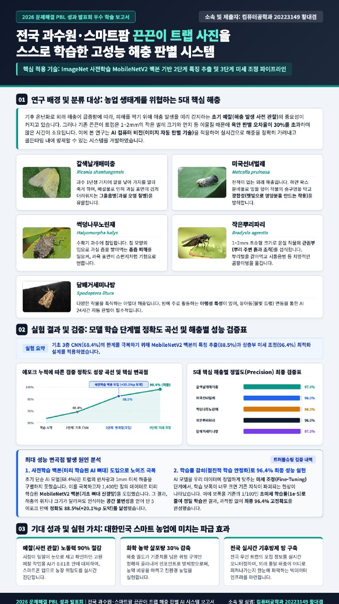
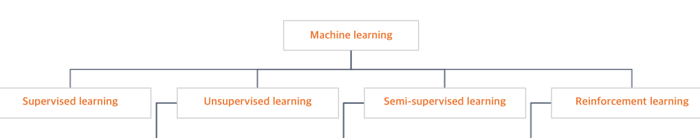

<a id="project-overview-added"></a>

[프로젝트 안내](#project-overview-added) · [기존 README 전체 내용](#original-readme-preserved)

# Machine Learning Notes & Pest Classification Study

**머신러닝 기초 학습 기록과 해충 이미지 분류 주제의 PBL 자료를 정리한 저장소입니다.**

지도·비지도 학습, K-means, GMM, PCA, t-SNE를 공부하고, CNN → MobileNetV2 특징 추출 → 미세 조정의 비교 과정을 노트북과 포스터로 구성했습니다.

`Python` · `Jupyter Notebook` · `NumPy / pandas` · `Matplotlib / Seaborn`

[기초 학습 노트](#original-readme-preserved) · [프로젝트 노트북](Project/해충_학습모델.ipynb) · [포스터 PDF](Project/해충_학습모델_포스터.pdf)

## 자료 미리보기

<a href="Project/해충_학습모델_포스터.pdf"></a>

> 기존 포스터의 미리보기입니다. 포스터와 노트북의 성능 수치는 아래 설명처럼 예시로 읽어야 합니다.

## 프로젝트 구성과 현재 범위

| 자료 | 내용 |
| --- | --- |
| 기초 학습 노트 | 지도·비지도 학습, 군집화, 차원 축소 개념과 그림 |
| 해충 분류 노트북 | 5종 해충 데이터 소개, 모델 단계 설명, 비교표·그래프·리포트 예시 |
| 포스터 | 연구 배경과 모델 개선 과정을 시각적으로 요약 |

**현재 노트북의 모델 함수는 실제 신경망을 학습하는 코드가 아니라 설명용 메시지를 출력하는 구현입니다.** 정확도 `68.4% → 88.5% → 96.4%`, 추론 시간 및 혼동 행렬은 코드에 직접 입력된 예시 값입니다. 이 저장소만으로 실제 학습·평가 결과나 성능을 재현할 수는 없습니다.

분류 대상으로 소개한 해충은 갈색날개매미충, 미국선녀벌레, 썩덩나무노린재, 작은뿌리파리, 담배거세미나방입니다.

## 노트북 열기

```bash
git clone https://github.com/unknownamed/Deep-Learning-Basics.git
cd Deep-Learning-Basics
python -m venv .venv
```

Windows는 `.\.venv\Scripts\Activate.ps1`, macOS/Linux는 `source .venv/bin/activate`로 활성화합니다.

```bash
python -m pip install jupyter numpy pandas matplotlib seaborn
jupyter notebook
```

`Project/해충_학습모델.ipynb`를 열면 예시 표·그래프를 실행해 볼 수 있습니다. 한글 그래프에는 Windows의 맑은 고딕, macOS의 AppleGothic, Linux의 NanumGothic 설정을 사용합니다.

## 실제 모델 실험으로 확장할 부분

- 데이터 취득 및 전처리·학습/검증/테스트 분할
- CNN·MobileNetV2 모델 정의와 실제 학습 루프
- 모델 가중치 저장, 테스트 예측에서 계산한 지표와 혼동 행렬
- 실행 환경·데이터 버전·측정 방법 기록

기존 자료와 학습 과정은 아래의 [기존 README 전체 내용](#original-readme-preserved)에 그대로 남겨두었습니다.

---

<a id="original-readme-preserved"></a>

## 기존 README 전체 내용

# 머신러닝에 대해 알아보자!

## 데이터의 정답여부에 따라 나뉘는 분류

정답이있다 → 지도 학습, 준지도 학습 (자신이 스스로 정답을 만든다 ~ Like LLM)

정답이 없다 → 비지도 학습

보상에 따른 학습 → 강화 학습(함수 극대화?)



참고) 해당 순서도를 통해서 적합한 모델을 선정 가능하다


## 1. 지도 학습

2가지 분류

1. Classification → Class로 구분될수 있는 Catergorical한(카테고리가 존재하는 데이터를 분류 ex) 개, 고양이 ~ Like LLM)
    
    참고) 빨간 네모 박스는 생존 여부에 대해 0,1로 예측 진행한 것이다.
    
    
    
2. Regression → 연속적인 형태의 정답을 맞추기 위해 사용(나이와 같은 연속적인 데이터)
    
    참고) 빨간 네모 박스는 나이에 대한 예측을 진행한 것이다.
    
    
    

## 2. 비지도 학습

Clustering 알고리즘 → 데이터에 대한 정답X, 유사한 특성 데이터끼리 군집화 하는 것(특정 지점에 모이는 것)

Association→ 학습 데이터에 정답X, 열을 묶어서(Grouping) 동시에 일어날 연관성을 찾는 것

Transform → 데이터를 쉽게 해석 가능하게 처리하는 것, 고차원의 데이터를 저차원으로 차원수를 줄임(차원축소 알고리즘(PCA, t-SNE) → 차원의 저주(Curse of Dimensionality) 방지 → 희소 행렬(Sparse Matrix)로 인해 결측치로 예측력이 저하되는 것 방지)


1. Clustering(군집화)의 목표 
    1. 군집 간 유사성 최소화 (서로 다른 군집 간 데이터는 확실히 다름)
    2. 군집 내 유사성 최대화 (같은 군집 간 데이터는 확실히 비슷)
2. Clustering 평가 항목 → 타당성 평가
    
    정답 X → 정답(실제 값)과 예측(예측값)의 오차를 지표화 할수 없음 → (군집간 거리, 군집의 지름, 군집의 분산)을 이용
    
    참고) 
    
    왼쪽 그림 **Silhoutte score**(실루엣 스코어) → 군집된 정도를 밀집정도를 계산하여 평가
    
    참고) 밀집정도 평가 수식과 해당 값에 대한 해석
    
    
    
    
    
    오른쪽 그림 **Elbow method →** k(군집의 수)를 변화시켜서 → 비용함수가 꺾이는 부분을 찾는 것(k를 더 키워도 변화가 미미함)
    
    
    
3. Hard Clustering(Cluster에 포함 여부 표현 → OX) vs Soft Clustering(Cluster에 포함 되는 정도의 표현 → 50%)
    1. Hard Clustering → ex) K-means clustering(K개의 군집으로 나누어보며 최적의 군집 수 찾기
    
    
    
    1. Soft Clustering → ex) Gaussian Mixture Modeal(GMM)(전체 확률 분포 = 여러 정규 분포의 조합으로 만들어짐이라고 보고 각 분포에 속할 확률이 높은 데이터끼리 모음)
    
    
    
4. Transform → 차원축소 알고리즘
    1. PCA(Principle Component Analysis) 주성분 분석
        
        원본 데이터의 차원을 축소(선(축)에 투영(Projection)을 시키는데 축과 원본 데이터의 오차(거리)가 최소가 되는 주성분(축)을 찾음
        
        
        
        고차원의 데이터를 차원축소 → 직관적 해석이 어려움
        
        대용량 고차원 데이터 압축 → 활용
        
    2. t-SNE(t-Stochastic Neighborhood Embedding) 
        
        고차원 공간에서의 데이터 간 거리를 최대한 유지하며 차원 축소
        
        각 데이터마다 다른 데이터와의 유사도 확률 구함 → 해당 데이터를 중심으로 한 정규 분포에서 해당 데이터가 선택된 상태에서 다른 데이터를 선택한다(조건부 확률)로 계산
        
        
        
        

## Project 폴더 안내

`Project` 폴더에는 **전국 과수원·스마트팜 끈끈이 트랩 사진 기반 해충 판별 시스템** 프로젝트 자료가 들어있다.

- `해충_학습모델.ipynb`: AI 허브 디지털 트랩 포집 해충 데이터를 바탕으로 5대 핵심 해충을 분류하는 딥러닝 모델 분석 노트북
- `해충_학습모델_포스터.pdf`: 프로젝트 내용을 발표용으로 정리한 포스터

프로젝트에서는 갈색날개매미충, 미국선녀벌레, 썩덩나무노린재, 작은뿌리파리, 담배거세미나방을 분류 대상으로 설정했다. 기초 CNN 모델의 한계를 먼저 확인한 뒤, ImageNet 사전학습 MobileNetV2 백본을 활용한 특징 추출과 미세 조정 과정을 적용하여 모델 성능을 비교한다.

주요 결과는 다음과 같다.

- 기초 CNN 모델 정확도: 68.4%
- 특징 추출 전이학습 모델 정확도: 88.5%
- 미세 조정 최종 모델 정확도: 96.4%
- 최종 모델 장당 추론 속도: 약 0.012초
